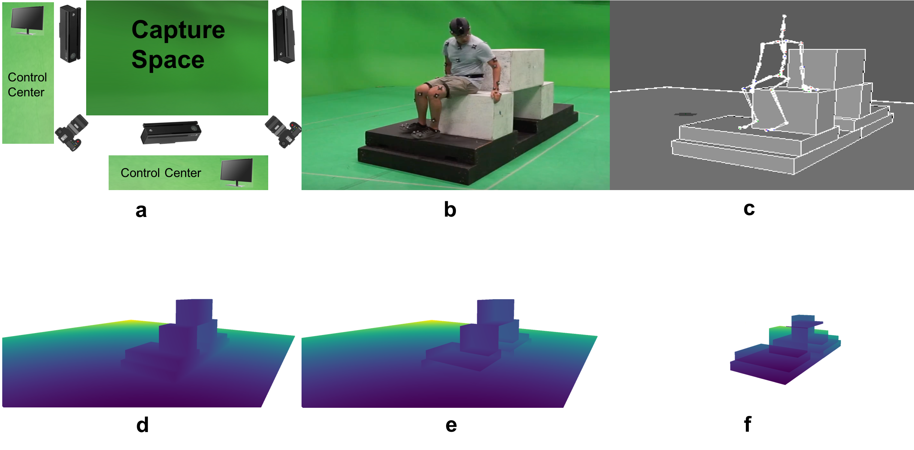
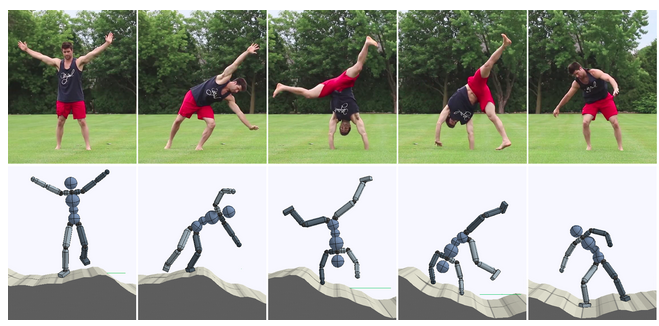

# Awesome Human Pose Estimation 

  

  

  

A collection of resources on human pose related problem: mainly focus on human pose estimation, and will include mesh representation, flow calculation, (inverse) kinematics, affordance, robotics, or sequence learning.

## Why awesome human pose estimation?

This is a collection of papers and resources I curated when learning the ropes in Human Pose estimation. And This is a fork from https://github.com/cbsudux/awesome-human-pose-estimation (thanks for cbsudux) and customized for personal study and sharing. I will be continuously updating this list with the latest papers and resources. If you want some theory on Human Pose Estimation, check out [Pose Related_Human_Knowledge](https://github.com/wangzheallen/pose_related_human_knowledge/blob/master/README.md)

## Related Pages:
https://github.com/xinghaochen/awesome-hand-pose-estimation
https://github.com/1adrianb/face-alignment
## Contributing

If you think I have missed out on something (or) have any suggestions (papers, implementations and other resources), feel free to [pull a request](https://github.com/wangzheallen/awesome-human-pose-estimation/pulls)

Feedback and contributions are welcome!

## Table of Contents
- [Basics](#basics)
- [Papers](#papers)
  - [2D Pose estimation](#2d-pose-estimation)
  - [3D Pose estimation](#3d-pose-estimation)
  - [Group of people](#group-of-people)
  - [Person generation](#Person-generation)
  - [Human mesh](#3D-Human-Mesh)
  - [Pose And Physics-Robotics](#Pose-And-Physics-Robotics)
  - [Pose and Language-Speech](#Pose-and-Language-Speech)
  - [Video pose](#video-pose)
  - [Real-time Pose estimation](#real-time-pose-estimation)
  - [Hand-Face Pose which is inspiring](#Hand-Face-landmark)
- [Datasets](#datasets)
- [Benchmarks](#Benchmarks)
- [Workshops](#workshops) 
- [Blog posts](#blogposts)
- [Popular implementations](#popular-implementations)
  - [PyTorch](#pytorch)
  - [TensorFlow](#tensorflow)
  - [Torch](#Torch)
  - [Others](#others)

## Basics
- [pose_related_human_knowledge](https://github.com/wangzheallen/pose_related_human_knowledge)

## Papers

### 2D Pose estimation
- [Learning Human Pose Estimation Features with Convolutional Networks](https://arxiv.org/pdf/1312.7302.pdf) - Jain, A., Tompson, J., Andriluka, M., Taylor, G.W., & Bregler, C. (ICLR 2013) 
- [DeepPose: Human Pose Estimation via Deep Neural Networks](https://arxiv.org/pdf/1312.4659.pdf) - Toshev, A., & Szegedy, C. (CVPR 2014)
- [Joint Training of a Convolutional Network and a Graphical Model for Human Pose Estimation](https://arxiv.org/pdf/1406.2984.pdf) - [[CODE]](https://github.com/max-andr/joint-cnn-mrf) - Tompson, J., Jain, A., LeCun, Y., & Bregler, C. (NIPS 2014) 
- [MoDeep: A Deep Learning Framework Using Motion Features for Human Pose Estimation](https://arxiv.org/pdf/1409.7963.pdf) - Jain, A., Tompson, J., LeCun, Y., & Bregler, C. (ACCV 2014)
- [Efficient Object Localization Using Convolutional Networks](http://citeseerx.ist.psu.edu/viewdoc/download?doi=10.1.1.858.5872&rep=rep1&type=pdf) - Tompson, J., Goroshin, R., Jain, A., LeCun, Y., & Bregler, C (CVPR 2015)
- [Flowing ConvNets for Human Pose Estimation in Videos](https://arxiv.org/pdf/1506.02897.pdf) - [[CODE]](https://github.com/tpfister/caffe-heatmap) - Pfister, T., Charles, J., & Zisserman, A. (ICCV 2015)
- [Convolutional Pose Machines](https://arxiv.org/pdf/1602.00134.pdf) - [[CODE]](https://github.com/shihenw/convolutional-pose-machines-release) - Wei, S., Ramakrishna, V., Kanade, T., & Sheikh, Y. (CVPR 2016)
- [Human Pose Estimation with Iterative Error Feedback](https://arxiv.org/pdf/1507.06550.pdf)- [[CODE]](https://github.com/pulkitag/ief) Carreira, J., Agrawal, P., Fragkiadaki, K., & Malik, J. (CVPR 2016) 
- [DeepCut: Joint Subset Partition and Labeling for Multi Person Pose Estimation](https://arxiv.org/pdf/1511.06645.pdf) - [[CODE]](https://github.com/eldar/deepcut) - Pishchulin, L., Insafutdinov, E., Tang, S., Andres, B., Andriluka, M., Gehler, P.V., & Schiele, B. (CVPR 2016)
- [DeeperCut: A Deeper, Stronger, and Faster Multi-Person Pose Estimation Model](https://arxiv.org/pdf/1605.03170.pdf) - [[CODE1]](https://github.com/eldar/deepcut-cnn)[[CODE2]](https://github.com/eldar/pose-tensorflow) - Insafutdinov, E., Pishchulin, L., Andres, B., Andriluka, M., & Schiele, B. (ECCV 2016)
- [Stacked Hourglass Networks for Human Pose Estimation](https://arxiv.org/pdf/1603.06937.pdf) - [[CODE]](https://github.com/umich-vl/pose-hg-demo) - Newell, A., Yang, K., & Deng, J. (ECCV 2016) 
- [Multi-context Attention for Human Pose Estimation](https://arxiv.org/pdf/1702.07432.pdf) - [[CODE]](https://github.com/bearpaw/pose-attention) - Chu, X., Yang, W., Ouyang, W., Ma, C., Yuille, A.L., & Wang, X. (CVPR 2017)
- [Towards Accurate Multi-person Pose Estimation in the Wild](https://arxiv.org/pdf/1701.01779.pdf) - [[CODE]](https://github.com/hackiey/keypoints) - Papandreou, G., Zhu, T., Kanazawa, N., Toshev, A., Tompson, J., Bregler, C., & Murphy, K.P. (CVPR 2017) 
- [Realtime Multi-person 2D Pose Estimation Using Part Affinity Fields](https://arxiv.org/pdf/1611.08050.pdf) - [[CODE]](https://github.com/ZheC/Realtime_Multi-Person_Pose_Estimation) - Cao, Z., Simon, T., Wei, S., & Sheikh, Y. (CVPR 2017) 
- [Learning Feature Pyramids for Human Pose Estimation](https://arxiv.org/pdf/1708.01101.pdf) - [[CODE]](https://github.com/bearpaw/PyraNet) - Yang, W., Li, S., Ouyang, W., Li, H., & Wang, X. (ICCV 2017)
- [Human Pose Estimation Using Global and Local Normalization](https://arxiv.org/pdf/1709.07220.pdf) - Sun, K., Lan, C., Xing, J., Zeng, W., Liu, D., & Wang, J. (ICCV 2017) 
- [Adversarial PoseNet: A Structure-Aware Convolutional Network for Human Pose Estimation](https://arxiv.org/pdf/1705.00389.pdf) - Chen, Y., Shen, C., Wei, X., Liu, L., & Yang, J. (ICCV 2017)
- [RMPE: Regional Multi-person Pose Estimation](https://arxiv.org/pdf/1612.00137.pdf) - [[CODE1]](https://github.com/Fang-Haoshu/RMPE)[[CODE2]](https://github.com/MVIG-SJTU/AlphaPose) - Fang, H., Xie, S., & Lu, C. (ICCV 2017)
- [Self Adversarial Training for Human Pose Estimation](https://arxiv.org/pdf/1707.02439.pdf) - [[CODE1]](https://github.com/dongzhuoyao/jessiechouuu-adversarial-pose)[[CODE2]](https://github.com/roytseng-tw/adversarial-pose-pytorch) - Chou, C., Chien, J., & Chen, H. (ArXiv 2017)
- [Recurrent Human Pose Estimation](https://arxiv.org/pdf/1605.02914.pdf) - [[CODE]](https://github.com/ox-vgg/keypoint_detection) - Belagiannis, V., & Zisserman, A. (FG 2017)
- [Knowledge-Guided Deep Fractal Neural Networks for Human Pose Estimation](https://arxiv.org/pdf/1705.02407.pdf) - [[CODE]](https://github.com/Guanghan/GNet-pose) Ning, G., Zhang, Z., & He, Z. (IEEE Transactions on Multimedia 2018)
- [Human Pose Estimation with Parsing Induced Learner](http://openaccess.thecvf.com/content_cvpr_2018/papers/Nie_Human_Pose_Estimation_CVPR_2018_paper.pdf)- Xuecheng Nie, Jiashi Feng, Yiming Zuo, Shuicheng Yan (CVPR 2018)
- [LSTM Pose Machines](https://arxiv.org/pdf/1712.06316.pdf) - [[CODE]](https://github.com/lawy623/LSTM_Pose_Machines) - Yue Luo, Jimmy Ren, Zhouxia Wang, Wenxiu Sun, Jinshan Pan, Jianbo Liu, Jiahao Pang, Liang Lin (CVPR 2018)
- [Cascaded Pyramid Network for Multi-Person Pose Estimation](https://arxiv.org/abs/1711.07319) - [[CODE]](https://github.com/chenyilun95/tf-cpn) - Yilun Chen, Zhicheng Wang, Yuxiang Peng, Zhiqiang Zhang, Gang Yu, Jian Sun (CVPR 2018)
- [Jointly Optimize Data Augmentation and Network Training: Adversarial Data Augmentation in Human Pose Estimation](https://arxiv.org/abs/1805.09707) - [[CODE]](https://github.com/zhiqiangdon/pose-adv-aug) - Peng, Xi and Tang, Zhiqiang and Yang, Fei and Feris, Rogerio S and Metaxas, Dimitris (CVPR 2018)
- [Human Pose Estimation with Parsing Induced Learner](http://openaccess.thecvf.com/content_cvpr_2018/papers/Nie_Human_Pose_Estimation_CVPR_2018_paper.pdf) - [[CODE]](https://github.com/NieXC/pytorch-pil) - Xuecheng Nie, Jiashi Feng, Yiming Zuo, Shuicheng Yan (CVPR 2018)
- [Through-Wall Human Pose Estimation Using Radio Signals ](http://openaccess.thecvf.com/content_cvpr_2018/papers/Zhao_Through-Wall_Human_Pose_CVPR_2018_paper.pdf) - Mingmin Zhao,Tianhong Li, Mohammad Abu Alsheikh, Yonglong Tian, Hang Zhao, Antonio Torralba, Dina Katabi (CVPR 2018)
- [Simple Baselines for Human Pose Estimation
and Tracking](http://openaccess.thecvf.com/content_ECCV_2018/papers/Bin_Xiao_Simple_Baselines_for_ECCV_2018_paper.pdf) - [[CODE]](https://github.com/Microsoft/human-pose-estimation.pytorch) - Bin, Xiao, Haiping Wu, Yichen Wei (ECCV 2018)
- [Multi-Scale Structure-Aware Network for Human Pose Estimation](http://openaccess.thecvf.com/content_ECCV_2018/papers/Lipeng_Ke_Multi-Scale_Structure-Aware_Network_ECCV_2018_paper.pdf) - Lipeng Ke, Ming-Ching Chang, Honggang Qi, Siwei Lyu (ECCV 2018)
- [Deeply Learned Compositional Models for Human Pose Estimation](http://openaccess.thecvf.com/content_ECCV_2018/papers/Wei_Tang_Deeply_Learned_Compositional_ECCV_2018_paper.pdf) - [[CODE]](http://www.ece.northwestern.edu/~wtt450/project/ECCV18_DLCM/) - Wei Tang, Pei Yu, Ying Wu (ECCV 2018)
- [MultiPoseNet: Fast Multi-Person Pose Estimation using Pose Residual Network](https://arxiv.org/abs/1807.04067) - [[CODE]](https://github.com/mkocabas/pose-residual-network) - Muhammed Kocabas, Salih Karagoz, Emre Akbas (ECCV 2018)
- [Real-time 2D Multi-Person Pose Estimation on CPU: Lightweight OpenPose](https://arxiv.org/pdf/1811.12004.pdf) - [[CODE]](https://github.com/Daniil-Osokin/lightweight-human-pose-estimation.pytorch) - Osokin, D. (Arxiv 2018)
- [Rethinking on Multi-Stage Networks for Human Pose Estimation](https://arxiv.org/pdf/1901.00148.pdf)  - Wenbo Li, Zhicheng Wang, Binyi Yin, Qixiang Peng, Yuming Du, Tianzi Xiao, Gang Yu,Hongtao Lu, Yichen Wei, and Jian Sun (Arxiv 2018)
- [CrowdPose: Efficient Crowded Scenes Pose Estimation and A New Benchmark](https://arxiv.org/abs/1812.00324) - [[CODE]](https://github.com/Jeff-sjtu/CrowdPose) - Jiefeng Li, Can Wang, Hao Zhu, Yihuan Mao, Hao-Shu Fang, Cewu Lu (CVPR 2019)
- [Deep High-Resolution Representation Learning for Human Pose Estimation](https://arxiv.org/abs/1902.09212) - [[CODE]](https://github.com/leoxiaobin/deep-high-resolution-net.pytorch) - [[CODE2]](https://github.com/stefanopini/simple-HRNet) - Ke Sun, Bin Xiao, Dong Liu, Jingdong Wang (CVPR 2019)
- [Human Pose Estimation with Spatial Contextual Information](https://arxiv.org/abs/1901.01760)  - Hong Zhang, Hao Ouyang, Shu Liu, Xiaojuan Qi, Xiaoyong Shen, Ruigang Yang, Jiaya Jia (Arxiv 2019)
- [PoseFix: Model-agnostic General Human Pose Refinement Network](https://arxiv.org/abs/1812.03595)  - [[CODE]](https://github.com/mks0601/PoseFix_RELEASE) - Moon, Gyeongsik and Chang, Juyong and Lee, Kyoung Mu (CVPR 2019)
- [Graphonomy: Universal Human Parsing via Graph Transfer Learning](https://arxiv.org/abs/1904.04536)  - [[CODE]](https://github.com/Gaoyiminggithub/Graphonomy) - Ke Gong, Yiming Gao, Xiaodan Liang, Xiaohui Shen, Meng Wang, Liang Lin (CVPR 2019)
- [PifPaf: Composite Fields for Human Pose Estimation](https://arxiv.org/abs/1903.06593)  - [[CODE]](https://github.com/vita-epfl/openpifpaf) - Sven Kreiss, Lorenzo Bertoni, Alexandre Alahi (CVPR 2019)
- [Person-in-WiFi: Fine-grained Person Perception using WiFi](https://arxiv.org/abs/1904.00276) - Fei Wang, Sanping Zhou, Stanislav Panev, Jinsong Han, Dong Huang (arxiv 2019)
- [Can WiFi Estimate Person Pose?](https://arxiv.org/abs/1904.00277) - Fei Wang, Stanislav Panev, Ziyi Dai, Jinsong Han, Dong Huang (arxiv 2019)
- [Learning to Learn Relation for Important People Detection in Still Images](https://arxiv.org/pdf/1904.03632.pdf)  - [[CODE]](https://weihonglee.github.io/Projects/POINT/POINT.htm) - Wei-Hong Li, Fa-Ting Hong, Wei-Shi Zheng (CVPR 2019)
- [Efficient Online Multi-Person 2D Pose Tracking with Recurrent Spatio-Temporal Affinity Fields](https://arxiv.org/abs/1811.11975)  - [[CODE]](https://cmu-perceptual-computing-lab.github.io/spatio-temporal-affinity-fields/) - Yaadhav Raaj, Haroon Idrees, Gines Hidalgo, Yaser Sheikh(CVPR 2019)
- [Adaptive NMS: Refining Pedestrian Detection in a Crowd](https://arxiv.org/abs/1904.03629) - Songtao Liu, Di Huang, Yunhong Wang (CVPR 2019)
- [Multi-Person Pose Estimation with Enhanced Channel-wise and Spatial Information](https://arxiv.org/abs/1905.03466) - Kai Su, Dongdong Yu, Zhenqi Xu, Xin Geng, Changhu Wang (CVPR 2019)
- [Fast Human Pose Estimation](https://arxiv.org/abs/1811.05419) - [[CODE]](https://github.com/yuanyuanli85/Fast_Human_Pose_Estimation_Pytorch) - Feng Zhang, Xiatian Zhu, Mao Ye (CVPR 2019)
- [Slim DensePose: Thrifty Learning from Sparse Annotations and Motion Cues](https://arxiv.org/abs/1906.05706)  - Natalia Neverova, James Thewlis, Rıza Alp Güler, Iasonas Kokkinos, Andrea Vedaldi (CVPR 2019)
- [Objects as Points](https://arxiv.org/abs/1904.07850) - [[CODE]](https://github.com/xingyizhou/CenterNet) - Xingyi Zhou, Dequan Wang, Philipp Krähenbühl (arxiv 2019)
- [Learning Individual Styles of Conversational Gesture](https://arxiv.org/abs/1906.04160) - [[CODE]](http://people.eecs.berkeley.edu/~shiry/speech2gesture/) - Shiry Ginosar, Amir Bar, Gefen Kohavi, Caroline Chan, Andrew Owens, Jitendra Malik (CVPR 2019)
- [Does Learning Specific Features for Related Parts Help Human Pose Estimation?](http://openaccess.thecvf.com/content_CVPR_2019/papers/Tang_Does_Learning_Specific_Features_for_Related_Parts_Help_Human_Pose_CVPR_2019_paper.pdf) - Wei Tang and Ying Wu (CVPR 2019)
- [Visual Person Understanding through Multi-Task and Multi-Dataset Learning](https://arxiv.org/pdf/1906.03019.pdf)  - Kilian Pfeiffer, et al (Arxiv 2019)
- [Movement science needs different pose tracking algorithms](https://arxiv.org/abs/1907.10226)  - Nidhi Seethapathi, Shaofei Wang, Rachit Saluja, Gunnar Blohm, Konrad P. Kording (Arxiv 2019)
- [Learning to Train with Synthetic Humans](https://arxiv.org/abs/1908.00967)  - David T. Hoffmann, Dimitrios Tzionas, Micheal J. Black, Siyu Tang (GCPR 2019)
- [Falls Prediction Based on Body Keypoints and Seq2Seq Architecture](https://arxiv.org/abs/1908.00275)  - Minjie Hua, Yibing Nan, Shiguo Lian (Arxiv 2019)
- [Cross-Domain Adaptation for Animal Pose Estimation](https://arxiv.org/abs/1908.05806)  - Jinkun Cao, Hongyang Tang, Hao-Shu Fang, Xiaoyong Shen, Cewu Lu, Yu-Wing Tai (ICCV 2019)
- [Pose Neural Fabrics Search](https://arxiv.org/abs/1909.07068)  - [[CODE]](https://github.com/yangsenius/PoseNFS) - Sen Yang, Wankou Yang, Zhen Cui (Arxiv 2019)
- [Anchor Loss: Modulating Loss Scale based on Prediction Difficulty](https://arxiv.org/pdf/1909.11155.pdf)  - Serim Ryou, Seong-Gyun Jeong, Pietro Perona (ICCV 2019)
- [Single-Network Whole-Body Pose Estimation](https://arxiv.org/pdf/1909.13423.pdf) - [[CODE]](https://github.com/CMU-Perceptual-Computing-Lab/openpose_train)  - Gines Hidalgo, Yaadhav Raaj, Haroon Idrees, Donglai Xiang, Hanbyul Joo, Tomas Simon, Yaser Sheikh (ICCV 2019)
- [The Devil is in the Details: Delving into Unbiased Data Processing for Human Pose Estimation](https://arxiv.org/abs/1911.07524)   - Junjie Huang, Zheng Zhu, Feng Guo, Guan Huang (Arxiv 2019)
- [DirectPose: Direct End-to-End Multi-Person Pose Estimation](https://arxiv.org/pdf/1911.07451.pdf)   - Zhi Tian, Hao Chen, Chunhua Shen (Arxiv 2019)
- [The Devil is in the Details: Delving into Unbiased Data Processing for Human Pose Estimation](https://arxiv.org/abs/1911.07524)  - Junjie Huang, Zheng Zhu, Feng Guo, Guan Huang (ICCV 2019)

### 3D Pose estimation
- [Reconstruction of Articulated Objects from Point Correspondences in a Single Uncalibrated Image](https://pdfs.semanticscholar.org/4034/943de699dd4d672d3d59b408459168785e9c.pdf) - CJ Taylor. (CVIU 2000)
- [Covariance-Scaled Sampling for Monocular 3D Body Tracking](http://www.maths.lth.se/sminchisescu/media/papers/css_cvpr01.pdf) - Cristian Sminchisescu and Bill Triggs. (CVPR 2001)
- [Improving the Scope of Deformable Model Shape and Motion Estimation](http://www.maths.lth.se/sminchisescu/media/papers/deform_cvpr01.pdf) - C. Sminchisescu and D. Metaxas and S. Dickinson. (CVPR 2001)
- [Recovering 3D Human Posefrom Monocular Images](https://www.microsoft.com/en-us/research/wp-content/uploads/2016/02/agarwal-triggs-pami06.pdf) - Ankur Agarwal and Bill Triggs. (PAMI 2006)
- [3D Human Pose Estimation from Monocular Images with Deep Convolutional Neural Network](http://visal.cs.cityu.edu.hk/static/pubs/conf/accv14-3dposecnn.pdf) - Li, S., & Chan, A.B. (ACCV 2014)
- [3D Pictorial Structures for Multiple Human Pose Estimation](http://campar.in.tum.de/pub/belagiannis2014cvpr/belagiannis2014cvpr.pdf) - Vasileios Belagiannis
, Sikandar Amin, Mykhaylo Andriluka,Bernt Schiele, Nassir Navab, and Slobodan Ilic (CVPR 2014)
- [3D Human pose estimation: A review of the literature and analysis of covariates](http://cbl.uh.edu/pub_files/nsarafianos_CVIU.pdf) (CVIU 2016)
- [Sparseness Meets Deepness: 3D Human Pose Estimation from Monocular Video](http://arxiv.org/abs/1511.09439) - [[CODE]](https://github.com/daniilidis-group/monocap) - X. Zhou, M. Zhu, G. Pavlakos, S. Leonardos, K.G. Derpanis, K. Daniilidis. (CVPR 2016)
- [Structured Prediction of 3D Human Pose with Deep Neural Networks](https://arxiv.org/pdf/1605.05180.pdf) - Tekin, B., Katircioglu, I., Salzmann, M., Lepetit, V., & Fua, P. (BMVC 2016)
- [VNect: Real-time 3D Human Pose Estimation with a Single RGB Camera](http://gvv.mpi-inf.mpg.de/projects/VNect/content/VNect_SIGGRAPH2017.pdf) - [[CODE]](https://github.com/timctho/VNect-tensorflow) - Mehta, Dushyant et al. (SIGGRAPH 2017)
- [Recurrent 3D Pose Sequence Machines](https://arxiv.org/pdf/1707.09695.pdf) - Lin, M., Lin, L., Liang, X., Wang, K., & Cheng, H. (CVPR 2017)
- [Lifting from the Deep: Convolutional 3D Pose Estimation from a Single Image](https://arxiv.org/pdf/1701.00295.pdf) - Tomè, D., Russell, C., & Agapito, L. (CVPR 2017)
- [3D Human Pose Estimation from a Single Image via Distance Matrix Regression](https://arxiv.org/abs/1611.09010) - Francesc Moreno-Noguer. (CVPR 2017)
- [3D Human Pose Estimation = 2D Pose Estimation + Matching](https://arxiv.org/pdf/1612.06524.pdf) - [[CODE]](https://github.com/flyawaychase/3DHumanPose) - Ching-Hang Chen, Deva Ramanan. (CVPR 2017)
- [Coarse-to-Fine Volumetric Prediction for Single-Image 3D Human Pose](https://arxiv.org/pdf/1611.07828.pdf) - [[CODE]](https://github.com/geopavlakos/c2f-vol-demo) - Pavlakos, G., Zhou, X., Derpanis, K.G., & Daniilidis, K. (CVPR 2017)
- [LCR-Net: Localization-Classification-Regression for Human Pose](https://www.researchgate.net/publication/315867122_LCR-Net_Localization-Classification-Regression_for_Human_Pose) - [[CODE]](https://thoth.inrialpes.fr/src/LCR-Net/) - Grégory Rogez, Philippe Weinzaepfel, Cordelia Schmid. (CVPR 2017)
- [Deep Learning on Lie Groups for Skeleton-based Action Recognition](https://github.com/zzhiwu/LieNet) - [[CODE]](https://github.com/zzhiwu/LieNet) - Zhiwu Huang, Chengde Wan, Thomas Probst, Luc Van Gool. (CVPR 2017)
- [Seeing invisible poses: Estimating3d body pose from egocentric video.](https://arxiv.org/abs/1603.07763)  - Hao Jiang, Kristen Grauman. (CVPR 2017)
- [Harvesting Multiple Views for Marker-less 3D Human Pose Annotations](https://www.seas.upenn.edu/~pavlakos/projects/harvesting/files/harvesting.pdf) - [[CODE]](https://github.com/geopavlakos/harvesting/) - G. Pavlakos, X. Zhou, K. Derpanis, K. Daniilidis.  (CVPR 2017)
- [Towards 3D Human Pose Estimation in the Wild: a Weakly-supervised Approach](https://arxiv.org/pdf/1704.02447.pdf) - [[CODE]](https://github.com/xingyizhou/Pytorch-pose-hg-3d) - Zhou, X., Huang, Q., Sun, X., Xue, X., & Wei, Y. (ICCV 2017)
- [Adversarial Inverse Graphics Networks: Learning 2D-to-3D Lifting and Image-to-Image Translation from Unpaired Supervision](https://arxiv.org/abs/1705.11166)  - Hsiao-Yu Fish Tung. etal. (ICCV 2017)
- [A Simple Yet Effective Baseline for 3d Human Pose Estimation](https://arxiv.org/pdf/1705.03098.pdf) - [[CODE]](https://github.com/weigq/3d_pose_baseline_pytorch) - Martinez, J., Hossain, R., Romero, J., & Little, J.J. (ICCV 2017)
- [Sparse Representation for 3D Shape Estimation: A Convex Relaxation Approach](http://arxiv.org/abs/1509.04309) - [[CODE]](http://www.cad.zju.edu.cn/home/xzhou/code/shapeconvex.zip) - X. Zhou, M. Zhu, S. Leonardos, K. Daniilidis. (PAMI 2017)
- [Compositional Human Pose Regression](https://arxiv.org/pdf/1704.00159.pdf) - Sun, X., Shang, J., Liang, S., & Wei, Y. (ICCV 2017)
- [Monocular 3D Human Pose Estimation In The Wild Using Improved CNN Supervision](http://gvv.mpi-inf.mpg.de/3dhp-dataset/) - Mehta, D., Rhodin, H., Casas, D., Fua, P., Sotnychenko, O., Xu, W., & Theobalt, C. (3DV 2017)
- [3D Human Pose Estimation in the Wild by Adversarial Learning](https://arxiv.org/pdf/1803.09722.pdf) - Yang, W., Ouyang, W., Wang, X., Ren, J.S., Li, H., & Wang, X. (CVPR 2018)
- [Ordinal Depth Supervision for 3D Human Pose Estimation](https://arxiv.org/pdf/1805.04095.pdf) - [[CODE]](https://github.com/geopavlakos/ordinal-pose3d/) - G. Pavlakos, X. Zhou, K. Daniilidis. (CVPR 2018)
- [V2V-PoseNet: Voxel-to-Voxel Prediction Network for Accurate 3D Hand and Human Pose Estimation From a Single Depth Map](https://arxiv.org/abs/1711.07399) - [[CODE]](https://github.com/mks0601/V2V-PoseNet_RELEASE) - Gyeongsik Moon, Ju Yong Chang, Kyoung Mu Lee. (CVPR 2018)
- [DRPose3D: Depth Ranking in 3D Human Pose Estimation](https://arxiv.org/pdf/1805.08973.pdf) - Wang, M., Chen, X., Liu, W., Qian, C., Lin, L., & Ma, L. (IJCAI 2018)
- [Human Motion Capture Using a Drone](https://arxiv.org/abs/1804.06112) - X. Zhou, S. Liu, G. Pavlakos, V.J. Kumar, K. Daniilidis. (ICRA 2018)
- [End-to-end Recovery of Human Shape and Pose](https://arxiv.org/pdf/1712.06584.pdf) - [[CODE]](https://github.com/akanazawa/hmr) - Kanazawa, A., Black, M.J., Jacobs, D.W., & Malik, J. (CVPR 2018)
- [Learning to Estimate 3D Human Pose and Shape from a Single Color Image](http://openaccess.thecvf.com/content_cvpr_2018/papers/Pavlakos_Learning_to_Estimate_CVPR_2018_paper.pdf) - Pavlakos, G., Zhu, L., Zhou, X., & Daniilidis, K. (CVPR 2018)
- [Monocular 3D Pose and Shape Estimation of Multiple People in Natural Scenes](http://www.maths.lth.se/sminchisescu/media/papers/Zanfir_Monocular_3D_Pose_CVPR_2018_paper.pdf) - Andrei Zanfir, Elisabeta Marinoiu, Cristian Sminchisescu. (CVPR 2018)
- [Dense Human Pose Estimation In The Wild](https://arxiv.org/pdf/1802.00434.pdf) - [[CODE]](https://github.com/facebookresearch/Densepose) - Guler, R.A., Neverova, N., & Kokkinos, I. (CVPR 2018)
- [Learning Monocular 3D Human Pose Estimation from Multi-View Images](https://arxiv.org/pdf/1803.04775.pdf) - Helge Rhodin, Jörg Spörri, Isinsu Katircioglu, Victor Constantin, Frédéric Meyer, Erich Müller, Mathieu Salzmann, Pascal Fua. (CVPR 2018)
- [3D Human Sensing, Action and Emotion Recognition inRobot Assisted Therapy of Children with Autism](http://www.maths.lth.se/sminchisescu/media/papers/Marinoiu_3D_Human_Sensing_CVPR_2018_paper.pdf) - Elisabeta Marinoiu, Mihai Zanfir, Vlad Olaru, Cristian Sminchisescu. (CVPR 2018)
- [Neural Body Fitting: Unifying Deep Learning and Model-Based Human Pose and Shape Estimation](https://arxiv.org/pdf/1808.05942.pdf) - [[CODE]](https://github.com/mohomran/neural_body_fitting) - Omran, Mohamed and Lassner, Christoph and Pons-Moll, Gerard and Gehler, Peter V. and Schiele, Bernt (3DV 2018)
- [Learning 3D Human Pose from Structure and Motion](http://openaccess.thecvf.com/content_ECCV_2018/papers/Rishabh_Dabral_Learning_3D_Human_ECCV_2018_paper.pdf) - Dabral, R., Mundhada, A., Kusupati, U., Afaque, S., Sharma, A., & Jain, A. (ECCV 2018)
- [Unsupervised Learning of View-invariant Action Representations](http://papers.nips.cc/paper/7401-unsupervised-learning-of-view-invariant-action-representations.pdf) - Junnan Li.etal. (NIPS 2018)
- [Deep Network for the Integrated 3D Sensing ofMultiple People in Natural Images](http://www.maths.lth.se/sminchisescu/media/papers/integrated-3d-sensing-of-multiple-people-in-natural-images_neurips2018.pdf) - Andrei Zanfir.etal. (NIPS 2018)
- [Integral Human Pose Regression](https://arxiv.org/pdf/1711.08229.pdf) - [[CODE]](https://github.com/JimmySuen/integral-human-pose) - Sun, X., Xiao, B., Liang, S., & Wei, Y. (ECCV 2018)
- [Dense Pose Transfer](https://arxiv.org/pdf/1809.01995.pdf) - Neverova, N., Guler, R.A., & Kokkinos, I. (ECCV 2018)
- [Deformable Pose Traversal Convolutionfor 3D Action and Gesture Recognition](http://openaccess.thecvf.com/content_ECCV_2018/papers/Junwu_Weng_Deformable_Pose_Traversal_ECCV_2018_paper.pdf) - Junwu Weng.et.al. (ECCV 2018)
- [Deep Autoencoder for Combined Human Pose Estimation and Body Model Upscaling](https://cvssp.org/projects/totalcapture/ECCV1UpscalePoseAutoencoder//FinalPaper.pdf) - Matthew Trumble, Andrew Gilbert, Adrian Hilton, John Collomosse (ECCV 2018)
- [Unsupervised Geometry-Aware Representation for 3D Human Pose Estimation](http://openaccess.thecvf.com/content_ECCV_2018/papers/Helge_Rhodin_Unsupervised_Geometry-Aware_Representation_ECCV_2018_paper.pdf) - [[CODE]](https://github.com/hrhodin/UnsupervisedGeometryAwareRepresentationLearning) - Rhodin, H., Salzmann, M., & Fua, P. (ECCV 2018)
- [Monocap: Monocular human motion capture using a CNN coupled with a geometric prior](https://arxiv.org/abs/1701.02354) - [[CODE]](https://github.com/daniilidis-group/monocap) - X. Zhou, M. Zhu, G. Pavlakos, S. Leonardos, K.G. Derpanis, K. Daniilidis. (TPAMI 2018)
- [Single-Shot Multi-Person 3D Pose Estimation From Monocular RGB](https://arxiv.org/pdf/1712.03453.pdf) - [[CODE1]](http://gvv.mpi-inf.mpg.de/projects/SingleShotMultiPerson/)[[CODE2]](https://github.com/Daniil-Osokin/lightweight-human-pose-estimation-3d-demo.pytorch) - Mehta, Dushyant and Sotnychenko, Oleksandr and Mueller, Franziska and Xu, Weipeng and Sridhar, Srinath and Pons-Moll, Gerard and Theobalt, Christian (3DV 2018)
- [HUMBI 1.0: HUman Multiview Behavioral Imaging Dataset](https://arxiv.org/pdf/1812.00281.pdf) (Arxiv 2018)
- [Explicit Pose Deformation Learning for Tracking Human Poses](https://arxiv.org/abs/1811.07123) - Xiao Sun, Chuankang Li, Stephen Lin (Arxiv 2018)
- [3D Human Pose Machines with Self-supervised Learning](https://arxiv.org/pdf/1901.03798.pdf) - [[CODE]](http://www.sysu-hcp.net/3d_pose_ssl/) - Keze Wang, Liang Lin, Chenhan Jiang, Chen Qian, and Pengxu Wei. (TPAMI 2019)
- [3D Human Pose Estimation with 2D Marginal Heatmaps](https://arxiv.org/abs/1806.01484) - [[CODE]](https://github.com/anibali/margipose) - Aiden Nibali, Zhen He, Stuart Morgan, Luke Prendergast. (WACV 2019)
- [Fast and Robust Multi-Person 3D Pose Estimation from Multiple Views](https://arxiv.org/abs/1901.04111) - [[CODE]](https://zju-3dv.github.io/mvpose/) - Junting Dong, Wen Jiang, Qixing Huang, Hujun Bao, Xiaowei Zhou. (CVPR 2019)
- [Learning the Depths of Moving People by Watching Frozen People](https://arxiv.org/abs/1904.11111)  - Zhengqi Li, Tali Dekel, Forrester Cole, Richard Tucker, Noah Snavely, Ce Liu, William T. Freeman. (CVPR 2019)
- [Monocular Total Capture: Posing Face, Body and Hands in the Wild ](https://arxiv.org/abs/1812.01598) - [[CODE]](http://domedb.perception.cs.cmu.edu/monototalcapture.html) - Donglai Xiang, Hanbyul Joo, Yaser Sheikh (CVPR 2019)
- [RepNet: Weakly Supervised Training of an Adversarial Reprojection Network for 3D Human Pose Estimation](https://arxiv.org/abs/1902.09868) - Bastian Wandt, Bodo Rosenhahn (CVPR 2019)
- [In the Wild Human Pose Estimation Using Explicit 2D Features and Intermediate 3D Representations](https://arxiv.org/abs/1904.03289) - Ikhsanul Habibie, Weipeng Xu, Dushyant Mehta, Gerard Pons-Moll, Christian Theobalt (CVPR 2019)
- [Semantic Graph Convolutional Networks for 3D Human Pose Regression](https://arxiv.org/abs/1904.03345) - [[CODE]](https://github.com/garyzhao/SemGCN) - Long Zhao, Xi Peng, Yu Tian, Mubbasir Kapadia, Dimitris N. Metaxas (CVPR 2019)
- [ON THE CONTINUITY OF ROTATION REPRESENTATIONS IN NEURAL NETWORKS ](https://arxiv.org/pdf/1812.07035.pdf) - Yi Zhou*, Connelly Barnes*, Jingwan Lu, Jimei Yang, Hao Li  (CVPR 2019)
- [Self-Supervised Learning of 3D Human Pose using Multi-view Geometry](https://arxiv.org/abs/1903.02330)  - [[CODE]](https://github.com/mkocabas/EpipolarPose)  - Muhammed Kocabas, Salih Karagoz, Emre Akbas, (CVPR 2019)
- [Generating Multiple Hypotheses for 3D Human Pose Estimation with Mixture Density Network](https://arxiv.org/abs/1904.05547)  - [[CODE]](https://github.com/chaneyddtt/Generating-Multiple-Hypotheses-for-3D-Human-Pose-Estimation-with-Mixture-Density-Network)  - Chen Li, Gim Hee Lee (CVPR 2019)
- [Neural Scene Decomposition for Multi-Person Motion Capture](https://arxiv.org/abs/1903.05684)  - Helge Rhodin, Victor Constantin, Isinsu Katircioglu, Mathieu Salzmann, Pascal Fua (CVPR 2019)
- [Weakly-Supervised Discovery of Geometry-Aware Representationfor 3D Human Pose Estimation](https://128.84.21.199/pdf/1903.08839.pdf)  - Xipeng Chen, Kwan-Yee Lin, Wentao Liu, Chen Qian, Liang Lin (CVPR 2019)
- [IGE-Net: Inverse Graphics Energy Networksfor Human Pose Estimation and Single-View Reconstruction](http://openaccess.thecvf.com/content_CVPR_2019/papers/Jack_IGE-Net_Inverse_Graphics_Energy_Networks_for_Human_Pose_Estimation_and_CVPR_2019_paper.pdf)  - Dominic Jack etal (CVPR 2019)
- [Monocular 3D Human Pose Estimation by Generation and Ordinal Ranking](https://arxiv.org/abs/1904.01324)  - [[CODE]](https://github.com/ssfootball04/generative_pose) - Saurabh Sharma, Pavan Teja Varigonda, Prashast Bindal, Abhishek Sharma, Arjun Jain (Arxiv 2019)
- [Estimating 3D Motion and Forces of Person-Object Interactions from Monocular Video](https://arxiv.org/abs/1904.02683) - Zongmian Li, Jiri Sedlar, Justin Carpentier, Ivan Laptev, Nicolas Mansard, Josef Sivic (Arxiv 2019)
- [Context-aware Human Motion Prediction](https://arxiv.org/abs/1904.03419) - Enric Corona, Albert Pumarola, Guillem Alenyà, Francesc Moreno (Arxiv 2019)
- [Unsupervised 3D Pose Estimation with Geometric Self-Supervision](https://arxiv.org/abs/1904.04812) - Ching-Hang Chen, Ambrish Tyagi, Amit Agrawal, Dylan Drover, Rohith MV, Stefan Stojanov, James M. Rehg (Arxiv 2019)
- [Generalizing Monocular 3D Human Pose Estimation in the Wild](https://arxiv.org/abs/1904.05512) - [[CODE]](https://github.com/llcshappy/Monocular-3D-Human-Pose) - Luyang Wang, Yan Chen, Zhenhua Guo, Keyuan Qian, Mude Lin, Hongsheng Li, Jimmy S. Ren (Arxiv 2019)
- [Absolute Human Pose Estimation with Depth Prediction Network](https://arxiv.org/abs/1904.05947) - Márton Véges, András Lőrincz (IJCNN 2019)
- [You2Me: Inferring Body Pose in Egocentric Video via First and Second Person Interactions](https://arxiv.org/abs/1904.09882)  - [[CODE]](http://vision.cs.utexas.edu/projects/you2me/)  - Evonne Ng, Donglai Xiang, Hanbyul Joo, Kristen Grauman (Arxiv 2019)
- [Learnable Triangulation of Human Pose](https://arxiv.org/abs/1905.05754) - [[CODE]](https://saic-violet.github.io/learnable-triangulation/) - Karim Iskakov, Egor Burkov, Victor Lempitsky, Yury Malkov (ICCV 2019)
- [Not All Parts Are Created Equal: 3D Pose Estimation by Modelling Bi-directional Dependencies of Body Parts](https://arxiv.org/abs/1905.07862)  - Jue Wang, Shaoli Huang, Xinchao Wang, Dacheng Tao (Arxiv 2019)
- [MONET: Multiview Semi-supervised Keypoint via Epipolar Divergence](https://arxiv.org/abs/1806.00104)  - Yasamin Jafarian, Yuan Yao, Hyun Soo Park (Arxiv 2018)
- [Feature Boosting Network For 3D Pose Estimation](https://arxiv.org/abs/1901.04877)  - Jun Liu, Henghui Ding, Amir Shahroudy, Ling-Yu Duan, Xudong Jiang, Gang Wang, Alex C. Kot (TPAMI 2019)
- [Ego-Pose Estimation and Forecasting as Real-Time PD Control](https://arxiv.org/abs/1906.03173) - [[CODE]](https://www.ye-yuan.com/ego-pose/)  - Ye Yuan, Kris Kitani (ICCV 2019)
- [Understanding Human Context in 3D Scenes by Learning Spatial Affordances with Virtual Skeleton Models](https://arxiv.org/abs/1906.05498)  - Lasitha Piyathilaka, Sarath Kodagoda (Arxiv 2019)
- [XNect: Real-time Multi-person 3D Human Pose Estimation with a Single RGB Camera](https://arxiv.org/abs/1907.00837) - [[CODE]](https://github.com/mehtadushy/SelecSLS-Pytorch) - Dushyant Mehta, Oleksandr Sotnychenko, Franziska Mueller, Weipeng Xu, Mohamed Elgharib, Pascal Fua, Hans-Peter Seidel, Helge Rhodin, Gerard Pons-Moll, Christian Theobalt (Arxiv 2019)
- [Camera Distance-aware Top-down Approach for 3D Multi-person Pose Estimation from a Single RGB Image](https://arxiv.org/abs/1907.11346)  - [[CODE]](https://github.com/mks0601/3DMPPE_ROOTNET_RELEASE)  - [[CODE]](https://github.com/mks0601/3DMPPE_POSENET_RELEASE)  - Gyeongsik Moon, Ju Yong Chang, Kyoung Mu Lee (ICCV 2019)
- [xR-EgoPose: Egocentric 3D Human Pose from an HMD Camera](https://arxiv.org/abs/1905.07718)  - Denis Tome, Patrick Peluse, Lourdes Agapito, Hernan Badino (ICCV 2019)
- [Semantic Estimation of 3D Body Shape and Pose using Minimal Cameras](https://arxiv.org/abs/1908.03030)  - Andrew Gilbert, Matthew Trumble, Adrian Hilton, John Collomosse (Arxiv 2019)
- [Resolving 3D Human Pose Ambiguities with 3D Scene Constraints](https://arxiv.org/abs/1908.06963)  - [[Data]](https://prox.is.tue.mpg.de/) - [[CODE]](https://github.com/MohameHassan/prox) - Mohamed Hassan, Vasileios Choutas, Dimitrios Tzionas, Michael J. Black (ICCV 2019)
- [Distill Knowledge from NRSfM for Weakly Supervised 3D Pose Learning](https://arxiv.org/abs/1908.06377)   - Chaoyang Wang, Chen Kong, Simon Lucey (Arxiv 2019)
- [Single-Stage Multi-Person Pose Machines](https://arxiv.org/abs/1908.09220)   - Xuecheng Nie, Jianfeng Zhang, Shuicheng Yan, Jiashi Feng (ICCV 2019)
- [A2J: Anchor-to-Joint Regression Network for 3D Articulated Pose Estimation from a Single Depth Image](https://arxiv.org/abs/1908.09999) - [[CODE]](https://github.com/zhangboshen/A2J)   - Fu Xiong, Boshen Zhang, Yang Xiao, Zhiguo Cao, Taidong Yu, Joey Tianyi Zhou, Junsong Yuan (ICCV 2019)
- [Cross View Fusion for 3D Human Pose Estimation](https://chunyuwang.netlify.com/img/ICCV_Cross_view_camera_ready.pdf) - [[CODE]](https://github.com/microsoft/multiview-human-pose-estimation-pytorch)   - Haibo Qiu, Chunyu Wang, Jingdong Wang, Naiyan Wang, Wenjun Zeng (ICCV 2019)
- [Optimizing Network Structure for 3D Human Pose Estimation](https://chunyuwang.netlify.com/)  - Hai Ci, Chunyu Wang, Xiaoxuan Ma, Yizhou Wang, (ICCV 2019)
- [Motion Capture from Pan-Tilt Cameras with Unknown Orientation](https://arxiv.org/pdf/1908.11676.pdf)  - Roman Bachmann, Jörg Spörri, Pascal Fua, Helge Rhodin (3DV 2019)
- [C3DPO: Canonical 3D Pose Networks for Non-Rigid Structure From Motion](https://arxiv.org/abs/1909.02533)  - David Novotny, Nikhila Ravi, Benjamin Graham, Natalia Neverova, Andrea Vedaldi (arxiv 2019)
- [MonoLoco: Monocular 3D Pedestrian Localization and Uncertainty Estimation](https://arxiv.org/abs/1906.06059)  - [[CODE]](https://github.com/vita-epfl/monoloco) - Lorenzo Bertoni, Sven Kreiss, Alexandre Alahi (ICCV 2019)
- [Multi-Person 3D Human Pose Estimation from Monocular Images](https://arxiv.org/abs/1909.10854)   - Rishabh Dabral, Nitesh B Gundavarapu, Rahul Mitra, Abhishek Sharma, Ganesh Ramakrishnan, Arjun Jain (3DV 2019)
- [Human Synthesis and Scene Compositing](https://arxiv.org/abs/1909.10307)   - Mihai Zanfir, Elisabeta Oneata, Alin-Ionut Popa, Andrei Zanfir, Cristian Sminchisescu (Arxiv 2019)
- [MocapNET: Ensemble of SNN Encoders for 3D Human Pose Estimation in RGB Images](http://users.ics.forth.gr/~argyros/mypapers/2019_09_BMVC_mocapnet.pdf)  - [[CODE]](https://github.com/FORTH-ModelBasedTracker/MocapNET) - Qammaz, Ammar and Argyros, Antonis A (BMVC 2019)
- [Adversarial Attack on Skeleton-based HumanAction Recognition](https://arxiv.org/pdf/1909.06500.pdf)   -Jian Liu, Naveed Akhtar, and Ajmal Mian, (Arxiv 2019)
- [Learning to Reconstruct 3D Human Pose and Shape via Model-fitting in the Loop](https://arxiv.org/abs/1909.12828)  - [[CODE]](https://www.seas.upenn.edu/~nkolot/projects/spin/) - Nikos Kolotouros, Georgios Pavlakos, Michael J. Black, Kostas Daniilidis (ICCV 2019)
- [DenseRaC: Joint 3D Pose and Shape Estimation by Dense Render-and-Compare](https://arxiv.org/abs/1910.00116)  - Yuanlu Xu, Song-Chun Zhu, Tony Tung (ICCV 2019)
- [A Neural Network for Detailed Human Depth Estimation from a Single Image](https://arxiv.org/abs/1910.12032)  - Kun Zhou, Xiaoguang Han, Nianjuan Jiang, Kui Jia, Jiangbo Lu (ICCV 2019)
- [Chirality Nets for Human Pose Regression](https://arxiv.org/abs/1911.00029)  - Raymond A. Yeh, Yuan-Ting Hu, Alexander G. Schwing (NIPS 2019)
- [Learning Graph Convolutional Network for Skeleton-based Human Action Recognition by Neural Searching](https://arxiv.org/abs/1911.04131)  - Wei Peng, Xiaopeng Hong, Haoyu Chen, Guoying Zhao (Arxiv 2020)
- [A Neural Network for Detailed Human Depth Estimation from a Single Image] (https://arxiv.org/abs/1910.01275)  - Sicong Tang, Feitong Tan, Kelvin Cheng, Zhaoyang Li, Siyu Zhu, Ping Tan (ICCV 2019)
- [HEMlets Pose: Learning Part-Centric Heatmap Triplets for Accurate 3D Human Pose Estimation](https://arxiv.org/abs/1910.01275)  - Kun Zhou, Xiaoguang Han, Nianjuan Jiang, Kui Jia, Jiangbo Lu (ICCV 2019)
- [Convex Optimisation for Inverse Kinematics](https://arxiv.org/abs/1910.11016)  - Tarun Yenamandra, Florian Bernard, Jiayi Wang, Franziska Mueller, Christian Theobalt (Arxiv 2019)
- [AbsPoseLifter: Absolute 3D Human Pose Lifting Network from a Single Noisy 2D Human Pose](https://arxiv.org/abs/1910.12029)  - Ju Yong Chang, Gyeongsik Moon, Kyoung Mu Lee (Arxiv 2019)
- [SMART: Skeletal Motion Action Recognition aTtack](https://arxiv.org/abs/1911.07107)  - He Wang, Feixiang He, Zexi Peng, Yongliang Yang, Tianjia Shao, Kun Zhou, David Hogg (Arxiv 2019)
- [Geometric Pose Affordance: 3D Human Pose with Scene Constraints](https://arxiv.org/abs/1905.07718)  - Zhe Wang, Liyan Chen, Shaurya Rathore, Daeyun Shin, Charless Fowlkes (Arxiv 2019)

### Geometry
- [Learning Two-View Correspondences and Geometry Using Order-Aware Network](https://arxiv.org/abs/1908.04964)  - Jiahui Zhang, Dawei Sun, Zixin Luo, Anbang Yao, Lei Zhou, Tianwei Shen, Yurong Chen, Long Quan, Hongen Liao (ICCV 2019)
- [UprightNet: Geometry-Aware Camera Orientation Estimation from Single Images](https://arxiv.org/abs/1908.07070)  - Wenqi Xian, Zhengqi Li, Matthew Fisher, Jonathan Eisenmann, Eli Shechtman, Noah Snavely (Arxiv 2019)
- [Gravity as a Reference for Estimating a Person's Height from Video](https://arxiv.org/abs/1909.02211)  - Didier Bieler, Semih Günel, Pascal Fua, Helge Rhodin (ICCV 2019)
- [End-to-End Multi-View Fusion for 3D Object Detection in LiDAR Point Clouds](https://arxiv.org/abs/1910.06528)  - DYin Zhou, Pei Sun, Yu Zhang, Dragomir Anguelov, Jiyang Gao, Tom Ouyang, James Guo, Jiquan Ngiam, Vijay Vasudevan (CoRL 2019)
- [EGenerating Human Action Videos by Coupling 3D Game Engines and Probabilistic Graphical Models](https://arxiv.org/abs/1910.06699)  - César Roberto de Souza, Adrien Gaidon, Yohann Cabon, Naila Murray, Antonio Manuel López (IJCV 2019)
- [Unsupervised High-Resolution Depth Learning From Videos With Dual Networks](https://arxiv.org/abs/1910.08897)  - Junsheng Zhou, Yuwang Wang, Kaihuai Qin, Wenjun Zeng (ICCV 2019)
- [Moving Indoor: Unsupervised Video Depth Learning in Challenging Environments](https://arxiv.org/abs/1910.08898)  - Junsheng Zhou, Yuwang Wang, Kaihuai Qin, Wenjun Zeng (ICCV 2019)
- [6-PACK: Category-level 6D Pose Tracker with Anchor-Based Keypoints](https://arxiv.org/abs/1910.10750)   -[[CODE]](https://sites.google.com/view/6packtracking)  - Chen Wang, Roberto Martín-Martín, Danfei Xu, Jun Lv, Cewu Lu, Li Fei-Fei, Silvio Savarese, Yuke Zhu (Arxiv 2019)
- [GraphX-Convolution for Point Cloud Deformation in 2D-to-3D Conversion](https://arxiv.org/abs/1911.06600)   -[[CODE]](https://justanhduc.github.io/2019/09/29/GraphX-Convolution.html)  - Anh-Duc Nguyen, Seonghwa Choi, Woojae Kim, Sanghoon Lee (ICCV 2019)
- [GIFT: Learning Transformation-Invariant Dense Visual Descriptors via Group CNNs](https://arxiv.org/abs/1911.05932)   -[[CODE]](https://zju3dv.github.io/GIFT/)  - Yuan Liu, Zehong Shen, Zhixuan Lin, Sida Peng, Hujun Bao, Xiaowei Zhou (NIPS 2019)
- [Conservative Wasserstein Training for Pose Estimation](https://arxiv.org/abs/1911.00962)   - Xiaofeng Liu, Yang Zou, Tong Che, Peng Ding, Ping Jia, Jane You, Kumar B.V.K (ICCV 2019)
- [Tell Me What They're Holding: Weakly-supervised Object Detection with Transferable Knowledge from Human-object Interaction](https://arxiv.org/abs/1911.08141)   - Daesik Kim, Gyujeong Lee, Jisoo Jeong, Nojun Kwak (AAAI 2020)
- [Single-Stage 6D Object Pose Estimation](https://arxiv.org/abs/1911.08324)   - Yinlin Hu, Pascal Fua, Wei Wang, Mathieu Salzmann (Arxiv 2019)

### Group of people
- [SOCIAL LSTM: HUMAN TRAJECTORY PREDICTION IN CROWDED SPACES.](http://vision.stanford.edu/pdf/CVPR16_N_LSTM.pdf)  - Alexandre Alahi, Kratarth Goel, Vignesh Ramanathan, Alexandre Robicquet, Li Fei-Fei, Silvio Savarese. (CVPR 2016)
- [Multi-Agent Tensor Fusion for Contextual Trajectory Prediction](https://arxiv.org/abs/1904.04776)  - Tianyang Zhao, Yifei Xu, Mathew Monfort, Wongun Choi, Chris Baker, Yibiao Zhao, Yizhou Wang, Ying Nian Wu (CVPR 2019)
- [Towards Social Artificial Intelligence: Nonverbal Social Signal Prediction in A Triadic Interaction](https://arxiv.org/abs/1906.04158)  - Hanbyul Joo, Tomas Simon, Mina Cikara, Yaser Sheikh (CVPR 2019)
- [Social-BiGAT: Multimodal Trajectory Forecasting using Bicycle-GAN and Graph Attention Networks](https://arxiv.org/abs/1907.03395)  - Vineet Kosaraju, Amir Sadeghian, Roberto Martín-Martín, Ian Reid, S. Hamid Rezatofighi, Silvio Savarese (Arxiv 2019)
- [To React or not to React: End-to-End Visual Pose Forecasting for Personalized Avatar during Dyadic Conversations](https://arxiv.org/abs/1910.02181)  - Chaitanya Ahuja, Shugao Ma, Louis-Philippe Morency, Yaser Sheikh (Arxiv 2019)

### Person generation
- [Activity Forecasting.](http://www.cs.cmu.edu/~kkitani/project/2014/08/01/forecasting-project/) - [[CODE]](http://www.cs.cmu.edu/~kkitani/datasets/index.html) - Kris M. Kitani, Brian Ziebart, James D. Bagnell and Martial Hebert. (ECCV 2012)
- [Action-Reaction: Forecasting the Dynamics of Human Interaction.](http://www.cs.cmu.edu/~kkitani/project/2014/01/01/reaction-project/) - De-An Huang and Kris M. Kitani. (ECCV 2014)
- [A deep learning framework for character motion synthesis and editing](https://dl.acm.org/citation.cfm?id=2925975) - [[CODE]](https://www.cs.cmu.edu/~xiaolonw/affordance.html)  (TOG 2016)
- [Binge Watching: Scaling Affordance Learning from Sitcoms. ](https://www.cs.cmu.edu/~xiaolonw/papers/CVPR_2017_VAE_affordance.pdf) - [[CODE]](https://www.cs.cmu.edu/~xiaolonw/affordance.html) - Xiaolong Wang*, Rohit Girdhar*, and Abhinav Gupta. (CVPR 2017)
- [Pose Guided Person Image Generation](https://arxiv.org/pdf/1705.09368.pdf) - [[CODE]](https://github.com/charliememory/Pose-Guided-Person-Image-Generation) - Ma, L., Jia, X., Sun, Q., Schiele, B., Tuytelaars, T., & Gool, L.V. (NIPS 2017)
- [A Generative Model of People in Clothing](https://arxiv.org/pdf/1705.04098.pdf) - Lassner, C., Pons-Moll, G., & Gehler, P.V. (ICCV 2017)
- [First-Person Activity Forecasting with Online Inverse Reinforcement Learning](https://www.ri.cmu.edu/wp-content/uploads/2017/11/Rhinehart_First-Person_Activity_Forecasting_ICCV_2017_paper.pdf) - Nicholas Rhinehart and Kris M. Kitani. (ICCV 2017)
- [Synthesizing Images of Humans in Unseen Poses](http://openaccess.thecvf.com/content_cvpr_2018/papers/Balakrishnan_Synthesizing_Images_of_CVPR_2018_paper.pdf) - [[CODE]](https://github.com/balakg/posewarp-cvpr2018) - Guha Balakrishnan, Amy Zhao, Adrian V. Dalca, Fredo Durand, John Guttag. (CVPR 2018)
- [A Variational U-Net for Conditional Appearance and Shape Generation](https://compvis.github.io/vunet/images/vunet.pdf) - [[CODE]](https://github.com/CompVis/vunet) - Patrick Esser, Ekaterina Sutter, Björn Ommer. (CVPR 2018)
- [Deformable GANs for Pose-based Human Image Generation](http://openaccess.thecvf.com/content_cvpr_2018/papers/Siarohin_Deformable_GANs_for_CVPR_2018_paper.pdf) - [[CODE]](https://github.com/AliaksandrSiarohin/pose-gan) - Siarohin, A., Sangineto, E., Lathuilière, S., & Sebe, N. (CVPR 2018)
- [Social GAN: Socially Acceptable Trajectories with Generative Adversarial Networks](https://arxiv.org/abs/1803.10892) - [[CODE]](https://github.com/agrimgupta92/sgan) - Agrim Gupta, Justin Johnson, Fei-Fei Li, Silvio Savarese, Alexandre Alahi. (CVPR 2018)
- [QuaterNet: A Quaternion-based Recurrent Model for Human Motion](https://arxiv.org/abs/1805.06485) - [[CODE]](https://github.com/facebookresearch/QuaterNet) - Dario Pavllo, David Grangier, and Michael Auli. (BMVC 2018)
- [Dense Pose Transfer](https://arxiv.org/pdf/1809.01995.pdf) - Neverova, N., Guler, R.A., & Kokkinos, I. (ECCV 2018)
- [MT-VAE: Learning Motion Transformations to Generate Multimodal Human Dynamics](https://arxiv.org/abs/1808.04545) - Xinchen Yan, Akash Rastogi, Ruben Villegas, Kalyan Sunkavalli, Eli Shechtman, Sunil Hadap, Ersin Yumer, Honglak Lee (ECCV 2018)
- [Few-Shot Human Motion Prediction via Meta-Learning](http://openaccess.thecvf.com/content_ECCV_2018/papers/Liangyan_Gui_Few-Shot_Human_Motion_ECCV_2018_paper.pdf) - Liang-Yan Gui, Yu-Xiong Wang, Deva Ramanan, and Jos ́e M. F. Moura (ECCV 2018)
- [Unsupervised Learning of Object Landmarks through Conditional Image Generation](https://papers.nips.cc/paper/7657-unsupervised-learning-of-object-landmarks-through-conditional-image-generation.pdf) - Tomas Jakab, Ankush Gupta, Hakan Bilen, Andrea Vedaldi (NIPS 2018)
- [FD-GAN: Pose-guided Feature Distilling GAN for Robust Person Re-identification](https://arxiv.org/abs/1810.02936)  - [[CODE]](https://github.com/yxgeee/FD-GAN) - Yixiao  Ge.etal. (NIPS 2018)
- [Soft-Gated Warping-GAN for Pose-Guided Person Image Synthesis](https://arxiv.org/abs/1810.11610)   - Haoye Dong.etal. (NIPS 2018)
- [AUTO-CONDITIONED LSTM NETWORK FOR EXTENDED COMPLEX HUMAN MOTION SYNTHESIS 
](https://arxiv.org/pdf/1707.05363.pdf)   - Yi Zhou*, Zimo Li*, Shuangjio Xiao, Chong He, Zeng Huang, Hao Li . (ICLR 2018)
- [ Everybody Dance Now](https://carolineec.github.io/everybody_dance_now/) - Caroline Chan, Shiry Ginosar, Tinghui Zhou, Alexei A. Efros  (Arxiv 2018)
- [SiCloPe: Silhouette-Based Clothed People](https://arxiv.org/pdf/1901.00049.pdf)  (Arxiv 2019)
- [Unpaired Pose Guided Human Image Generation](https://arxiv.org/abs/1901.02284) - Xu Chen, Jie Song, Otmar Hilliges (Arxiv 2019)
- [Peeking into the Future: Predicting Future Person Activities and Locations in Videos](https://arxiv.org/abs/1902.03748) - Junwei Liang, Lu Jiang, Juan Carlos Niebles, Alexander Hauptmann, Li Fei-Fei (Arxiv 2019)
- [Putting Humans in a Scene: Learning Affordance in 3D Indoor Environments](https://arxiv.org/abs/1903.05690)  - [[CODE]](https://sites.google.com/view/3d-affordance-cvpr19)  - Xueting Li, SIfei Liu, Kihwan Kim, Xiaolong Wang, Ming-Hsuan Yang, Jan Kautz (CVPR 2019)
- [Dense Intrinsic Appearance Flow for Human Pose Transfer](https://arxiv.org/abs/1903.11326)  - [[CODE]](http://mmlab.ie.cuhk.edu.hk/projects/pose-transfer/)  - Yining Li, Chen Huang, Chen Change Loy (CVPR 2019)
- [Vid2Game: Controllable Characters Extracted from Real-World Videos](https://arxiv.org/pdf/1904.08379.pdf)  - Oran Gafni, Lior Wolf, Yaniv Taigman (Arxiv 2019)
- [Textured Neural Avatars](https://arxiv.org/abs/1905.08776)  - [[CODE]](https://saic-violet.github.io/texturedavatar/) - Aliaksandra Shysheya, et al (Arxiv 2019)
- [Explicit Disentanglement of Appearance and Perspective in Generative Models](https://arxiv.org/pdf/1906.11881.pdf)  -Nicki S. Detlefsen,Søren Hauberg  (Arxiv 2019)
- [Learning Variations in Human Motion via Mix-and-Match Perturbation](https://arxiv.org/abs/1908.00733)  -Mohammad Sadegh Aliakbarian, Fatemeh Sadat Saleh, Mathieu Salzmann, Lars Petersson, Stephen Gould, Amirhossein Habibian  (Arxiv 2019)

### 3D Human Mesh
- [Video Based Reconstruction of 3D People Models](https://arxiv.org/pdf/1803.04758.pdf) - Thiemo Alldieck， Marcus Magnor， Weipeng Xu， Christian Theobalt， Gerard Pons-Moll， (CVPR 2018)
- [End-to-end Recovery of Human Shape and Pose](https://arxiv.org/pdf/1712.06584.pdf) - [[CODE]](https://github.com/akanazawa/hmr) - Kanazawa, A., Black, M.J., Jacobs, D.W., & Malik, J. (CVPR 2018)
- [Relighting Humans: Occlusion-Aware Inverse Rendering for Full-Body Human Images](https://arxiv.org/abs/1908.02714) - [[CODE]](http://kanamori.cs.tsukuba.ac.jp/projects/relighting_human/) - Yoshihiro Kanamori, Yuki Endo. (Siggraph 2018)
- [BodyNet: Volumetric Inference of 3D Human Body Shapes](https://arxiv.org/pdf/1804.04875v3.pdf) - [[CODE]](https://github.com/gulvarol/bodynet) - Varol, G., Ceylan, D., Russell, B., Yang, J., Yumer, E., Laptev, I., & Schmid, C. (ECCV 2018)
- [Learning to Reconstruct People in Clothing from a Single RGB Camera](https://arxiv.org/abs/1903.05885) - Thiemo Alldieck, Marcus Magnor, Bharat Lal Bhatnagar, Christian Theobalt, Gerard Pons-Moll (Arxiv 2019)
- [DeepHuman: 3D Human Reconstruction from a Single Image](https://arxiv.org/abs/1903.06473) - Zerong Zheng, Tao Yu, Yixuan Wei, Qionghai Dai, Yebin Liu (Arxiv 2019)
- [Learning 3D Human Dynamics from Video](https://arxiv.org/abs/1812.01601)  - [[CODE]](https://akanazawa.github.io/human_dynamics/) - Angjoo Kanazawa, Jason Y. Zhang, Panna Felsen, Jitendra Malik (CVPR 2019)
- [Detailed Human Shape Estimation from a Single Image by Hierarchical Mesh Deformation](https://arxiv.org/abs/1904.10506) - [[CODE]](https://github.com/zhuhao-nju/hmd) - Hao Zhu, Xinxin Zuo, Sen Wang, Xun Cao, Ruigang Yang (CVPR 2019)
- [LBS Autoencoder: Self-supervised Fitting of Articulated Meshes to Point Clouds](https://arxiv.org/abs/1904.10037) - Chun-Liang Li, Tomas Simon, Jason Saragih, Barnabás Póczos, Yaser Sheikh (CVPR 2019)
- [Convolutional Mesh Regression for Single-Image Human Shape Reconstruction](https://arxiv.org/abs/1905.03244) - [[CODE]](https://www.seas.upenn.edu/~nkolot/projects/cmr/) - Nikos Kolotouros, Georgios Pavlakos, Kostas Daniilidis (CVPR 2019)
- [Expressive Body Capture: 3D Hands, Face, and Body from a Single Image](https://arxiv.org/abs/1904.05866)  - [[CODE]](https://smpl-x.is.tue.mpg.de/) - [[CODE]](https://github.com/nghorbani/human_body_prior) - [[CODE]](https://github.com/nghorbani/homogenus) - Georgios Pavlakos, Vasileios Choutas, Nima Ghorbani, Timo Bolkart, Ahmed A. A. Osman, Dimitrios Tzionas, Michael J. Black (CVPR 2019)
- [Volumetric Capture of Humans with a Single RGBD Camera viaSemi-Parametric Learning](https://arxiv.org/pdf/1905.12162.pdf) - Rohit Pandey et al. (CVPR 2019)
- [DenseBody: Directly Regressing Dense 3D Human Pose and Shape From a Single Color Image](https://arxiv.org/pdf/1903.10153.pdf)  - [[CODE]](https://github.com/Lotayou/densebody_pytorch) - Pengfei Yao, Zheng Fang, Fan Wu, Yao Feng, Jiwei Li (Arxiv 2019)
- [Towards 3D Human Shape Recovery Under Clothing](https://arxiv.org/abs/1904.02601) - Xin Chen, Anqi Pang, Yu Zhu, Yuwei Li, Xi Luo, Ge Zhang, Peihao Wang, Yingliang Zhang, Shiying Li, Jingyi Yu (Arxiv 2019)
- [3DPeople: Modeling the Geometry of Dressed Humans](https://arxiv.org/abs/1904.04571) - Albert Pumarola, Jordi Sanchez, Gary P. T. Choi, Alberto Sanfeliu, Francesc Moreno-Noguer (Arxiv 2019)
- [Long-Term Video Generation of Multiple FuturesUsing Human Poses](https://arxiv.org/abs/1904.07538) - Naoya Fushishita, Antonio Tejero-de-Pablos, Yusuke Mukuta, Tatsuya Harada (Arxiv 2019)
- [PIFu: Pixel-Aligned Implicit Function for High-Resolution Clothed Human Digitization](https://arxiv.org/abs/1905.05172) - Shunsuke Saito, Zeng Huang, Ryota Natsume, Shigeo Morishima, Angjoo Kanazawa, Hao Li (Arxiv 2019)
- [Learning 3D Human Body Embedding](https://arxiv.org/abs/1905.05622) - Boyi Jiang, Juyong Zhang, Jianfei Cai, Jianmin Zheng (Arxiv 2019)
- [Shape Evasion: Preventing Body Shape Inference of Multi-Stage Approaches
](https://arxiv.org/abs/1905.11503) - Hosnieh Sattar, Katharina Krombholz, Gerard Pons-Moll, Mario Fritz (Arxiv 2019)
- [Temporally Coherent Full 3D Mesh Human Pose Recovery from Monocular Video](https://arxiv.org/abs/1906.00161) - Jian Liu, Naveed Akhtar, Ajmal Mian (Arxiv 2019)
- [Moulding Humans: Non-parametric 3D Human Shape Estimation from Single Images](https://arxiv.org/abs/1908.00439) - [[Studio]](https://kinovis.inria.fr/)  - Valentin Gabeur, Jean-Sebastien Franco, Xavier Martin, Cordelia Schmid, Gregory Rogez (ICCV 2019)
- [Dressing 3D Humans using a Conditional Mesh-VAE-GAN](https://arxiv.org/abs/1907.13615)  - Qianli Ma, Siyu Tang, Sergi Pujades, Gerard Pons-Moll, Anurag Ranjan, Michael J. Black (Arxiv 2019)
- [AMASS: Archive of Motion Capture as Surface Shapes](https://arxiv.org/abs/1904.03278)  - [[CODE]](https://github.com/nghorbani/amass)  - [[CODE]](https://github.com/nghorbani/amass/tree/master/notebooks) - Mahmood, Naureen and Ghorbani, Nima and F. Troje, Nikolaus and Pons-Moll, Gerard and Black, Michael J. (ICCV 2019)
- [Human Mesh Recovery from Monocular Images via a Skeleton-disentangled Representation](https://arxiv.org/abs/1908.07172)  - Sun Yu, Ye Yun, Liu Wu, Gao Wenpeng, Fu YiLi, Mei Tao (ICCV 2019)
- [Multi-Garment Net: Learning to Dress 3D People from Images](https://arxiv.org/abs/1908.06903)  - Bharat Lal Bhatnagar, Garvita Tiwari, Christian Theobalt, Gerard Pons-Moll (ICCV 2019)
- [Delving Deep Into Hybrid Annotations for 3D Human Recovery in the Wild](https://arxiv.org/abs/1908.06442) - [[CODE]](https://penincillin.github.io/dct_iccv2019) - Yu Rong, Ziwei Liu, Cheng Li, Kaidi Cao, Chen Change Loy (ICCV 2019)
- [Shape-Aware Human Pose and Shape Reconstruction Using Multi-View Images](https://arxiv.org/abs/1908.09464)  - Junbang Liang, Ming C. Lin (ICCV 2019)
- [Estimation of Body Mass Index from Photographs using Deep Convolutional Neural Networks](https://arxiv.org/abs/1908.11694)  - Adam Pantanowitz, Emmanuel Cohen, Philippe Gradidge, Nigel Crowther, Vered Aharonson, Benjamin Rosman, David M Rubin (arxiv 2019)
- [Video Interpolation and Prediction with Unsupervised Landmarks](https://arxiv.org/abs/1909.02749)  - Kevin J. Shih, Aysegul Dundar, Animesh Garg, Robert Pottorf, Andrew Tao, Bryan Catanzaro (arxiv 2019)
- [Learning to Reconstruct 3D Human Pose and Shape via Model-fitting in the Loop](https://arxiv.org/abs/1909.12828)  - [[CODE]](https://www.seas.upenn.edu/~nkolot/projects/spin/) - Nikos Kolotouros, Georgios Pavlakos, Michael J. Black, Kostas Daniilidis (ICCV 2019)
- [DenseRaC: Joint 3D Pose and Shape Estimation by Dense Render-and-Compare](https://arxiv.org/abs/1910.00116)  - Yuanlu Xu, Song-Chun Zhu, Tony Tung (ICCV 2019)
- [TexturePose: Supervising Human Mesh Estimation with Texture Consistency](https://arxiv.org/pdf/1910.11322.pdf)  - [[CODE]](https://github.com/geopavlakos/TexturePose) - YGeorgios Pavlakos, Nikos Kolotouros, Kostas Daniilidis (ICCV 2019)
- [Towards Robust RGB-D Human Mesh Recovery](https://arxiv.org/pdf/1911.07383.pdf)   - Ren Li, Changjiang Cai, Georgios Georgakis, Srikrishna Karanam, Terrence Chen, Ziyan Wu (Arxiv 2019)

### Pose And Physics-Robotics
- [Learning Locomotion Skills Using DeepRL: Does the Choice of Action Space Matter? ](https://xbpeng.github.io/projects/ActionSpace/index.html) - [[CODE]](https://xbpeng.github.io/projects/ActionSpace/index.html) - Xue Bin Peng, Michiel van de Panne (Eurographics 2017)
- [DeepMimic: Example-Guided Deep Reinforcement Learning of Physics-Based Character Skills ](https://xbpeng.github.io/projects/DeepMimic/index.html) - [[CODE]](https://xbpeng.github.io/projects/DeepMimic/index.html) - Xue Bin Peng, Pieter Abbeel, Sergey Levine, Michiel van de Panne  (SIGGRAPH 2018)
- [SFV: Reinforcement Learning of Physical Skills from Videos ](https://xbpeng.github.io/projects/SFV/index.html) - [[CODE]](https://xbpeng.github.io/projects/SFV/index.html) - Xue Bin Peng, Angjoo Kanazawa, Jitendra Malik, Pieter Abbeel, Sergey Levine  (SIGGRAPH Asia 2018)
- [Learning to Sit: Synthesizing Human-Chair Interactions via Hierarchical Control](https://arxiv.org/abs/1908.07423) - [[Video]](https://www.youtube.com/watch?v=3CeN0OGz2cA&feature=youtu.be) - Yu-Wei Chao, Jimei Yang, Weifeng Chen, Jia Deng  (Arxiv 2018)

### Pose and Language-Speech-Reasoning 
- [Your body language may shape who you are](https://www.ted.com/talks/amy_cuddy_your_body_language_shapes_who_you_are?language=en) (TED 2012)
- [Generating Animated Videos of Human Activities from Natural Language Descriptions](https://www.cs.utexas.edu/~huangqx/NeurIPS_ViGIL_Text2Animation.pdf) - Angela S. Lin, Lemeng Wu, Rodolfo Corona, Kevin Tai, Qixing Huang, Raymond J. Mooney (NIPS 2018)
- [Learning Individual Styles of Conversational Gesture](https://arxiv.org/abs/1906.04160) - [[CODE]](http://people.eecs.berkeley.edu/~shiry/speech2gesture/) - Shiry Ginosar, Amir Bar, Gefen Kohavi, Caroline Chan, Andrew Owens, Jitendra Malik (CVPR 2019)
- [HAKE: Human Activity Knowledge Engine](https://arxiv.org/abs/1904.06539) - [[CODE]](http://hake-mvig.cn/home/) - Yong-Lu Li, Liang Xu, Xijie Huang, Xinpeng Liu, Ze Ma, Mingyang Chen, Shiyi Wang, Hao-Shu Fang, Cewu Lu (Arxiv 2019)
- [Shape Evasion: Preventing Body Shape Inference of Multi-Stage Approaches
](https://arxiv.org/abs/1905.11503) - Hosnieh Sattar, Katharina Krombholz, Gerard Pons-Moll, Mario Fritz (Arxiv 2019)
- [Language2Pose: Natural Language Grounded Pose Forecasting
](https://arxiv.org/abs/1907.01108) - Chaitanya Ahuja, Louis-Philippe Morency (Arxiv 2019)
- [Word-level Deep Sign Language Recognition from Video: A New Large-scale Dataset and Methods Comparison
](https://arxiv.org/abs/1910.11006) - Dongxu Li, Cristian Rodriguez Opazo, Xin Yu, Hongdong Li (WACV 2020)
- [Motion Reasoning for Goal-Based Imitation Learning](https://arxiv.org/pdf/1911.05864.pdf) - De-An Huang, Yu-Wei Chao, Chris Paxton, Xinke Deng, Li Fei-Fei, Juan Carlos Niebles, Animesh Garg, Dieter Fox (Arxiv 2019)
- [Dancing to Music](https://arxiv.org/pdf/1911.02001.pdf) - [[CODE]](https://github.com/NVlabs/Dancing2Music) - Hsin-Ying Lee, Xiaodong Yang, Ming-Yu Liu, Ting-Chun Wang, Yu-Ding Lu, Ming-Hsuan Yang, Jan Kautz (NIPS 2019)

### Video pose
- [Nonrigid Structure from Motion in Trajectory Space](http://www.cs.cmu.edu/~yaser/AkhtarSheikhKhanKanade_NIPS2008.pdf) - Ijaz Akhter, Yaser Sheikh, Sohaib Khan and Takeo Kanade. (NIPS 2008)
- [Human Attributes from 3D Pose Tracking](https://www.cs.ubc.ca/~lsigal/Publications/eccv2010sigal.pdf) - Leonid Sigal, David J. Fleet, Nikolaus F. Troje, and Micha Livne. (ECCV 2010)
- [Pose from Flow and Flow from Pose](http://www.cis.upenn.edu/~jshi/papers/CVPR2013_posefromflow.pdf) - Katerina Fragkiadaki, Han Hu and Jianbo Shi . (CVPR 2013)
- [Recurrent Network Models for Human Dynamics](https://arxiv.org/pdf/1508.00271.pdf) - Katerina Fragkiadaki, Sergey Levine, Panna Felsen, Jitendra Malik . (ICCV 2015)
- [Personalizing Human Video Pose Estimation](https://arxiv.org/pdf/1511.06676.pdf) - James Charles, Tomas Pfister, Derek Magee, David Hogg, Andrew Zisserman . (CVPR 2016)
- [On human motion prediction using recurrent neural networks](http://openaccess.thecvf.com/content_cvpr_2017/papers/Martinez_On_Human_Motion_CVPR_2017_paper.pdf) - Julieta Martinez, Michael J. Black, and Javier Romero. (CVPR 2017)
- [Thin-Slicing Network: A Deep Structured Model for Pose Estimation in Videos](https://arxiv.org/pdf/1703.10898.pdf) - Jie Song, Limin Wang, Luc Van Gool, Otmar Hilliges. (CVPR 2017)
- [Deep Multitask Architecture for Integrated 2D and 3D Human Sensing,](http://openaccess.thecvf.com/content_cvpr_2017/papers/Popa_Deep_Multitask_Architecture_CVPR_2017_paper.pdf) - [[CODE]](https://github.com/alinionutpopa/dmhs) - Alin-Ionut Popa and Mihai Zanfir and Cristian Sminchisescu. (CVPR 2017)
- [Rpan: An end-to-end recurrent pose-attention network for action recognition in videos](http://openaccess.thecvf.com/content_ICCV_2017/papers/Du_RPAN_An_End-To-End_ICCV_2017_paper.pdf) - Wenbin Du, Yali Wang, Yu Qiao. (ICCV 2017)
- [Self-supervised Learning of Motion Capture](http://papers.nips.cc/paper/7108-self-supervised-learning-of-motion-capture.pdf) - [[CODE]](https://sites.google.com/view/selfsupervisedlearningofmotion/) - Hsiao-Yu Fish Tung,  Hsiao-Wei Tung,  Ersin Yumer,  Katerina Fragkiadaki. (NIPS 2017)
- [Detect-and-Track: Efficient Pose Estimation in Videos,](https://arxiv.org/abs/1712.09184) - [[CODE]](https://github.com/facebookresearch/DetectAndTrack/) - Rohit Girdhar, Georgia Gkioxari, Lorenzo Torresani, Manohar Paluri and Du Tran. (CVPR 2018)
- [Neural Kinematic Networks for Unsupervised Motion Retargeting,](https://eng.ucmerced.edu/people/jyang44/papers/cvpr2018_NeuralKinematicNetworks_camera_ready.pdf) - [[CODE]](https://github.com/rubenvillegas/cvpr2018nkn) - Ruben Villegas, Jimei Yang, Duygu Ceylan, Honglak Lee. (CVPR 2018)
- [2D/3D Pose Estimation and Action Recognition using Multitask Deep Learning](http://openaccess.thecvf.com/content_cvpr_2018/papers/Luvizon_2D3D_Pose_Estimation_CVPR_2018_paper.pdf) - [[CODE]](https://github.com/dluvizon/deephar) - Diogo C. Luvizon, David Picard, Hedi Tabia. (CVPR 2018)
- [Spatial Temporal Graph Convolutional Networks for Skeleton-Based Action Recognition,](https://arxiv.org/pdf/1801.07455.pdf) - [[CODE]](https://github.com/yysijie/st-gcn) - Sijie Yan, Yuanjun Xiong, and Dahua Lin. (AAAI 2018)
- [QuaterNet: A Quaternion-based Recurrent Model for Human Motion](https://arxiv.org/abs/1805.06485) - [[CODE]](https://github.com/facebookresearch/QuaterNet) - Dario Pavllo, David Grangier, and Michael Auli. (BMVC 2018)
- [Simple Baselines for Human Pose Estimation and Tracking](https://arxiv.org/pdf/1804.06208.pdf) - [[CODE]](https://github.com/Microsoft/human-pose-estimation.pytorch) - Bin Xiao, Haiping Wu, Yichen Wei. (ECCV 2018)
- [Exploiting temporal information for 3D pose estimation](https://arxiv.org/abs/1711.08585) - Mir Rayat Imtiaz Hossain, James J. Little (ECCV 2018)
- [Learning 3D Human Pose from Structure and Motion](http://openaccess.thecvf.com/content_ECCV_2018/papers/Rishabh_Dabral_Learning_3D_Human_ECCV_2018_paper.pdf) - Dabral, R., Mundhada, A., Kusupati, U., Afaque, S., Sharma, A., & Jain, A. (ECCV 2018)
- [Propagating LSTM: 3D Pose Estimation based on Joint Interdependency](http://openaccess.thecvf.com/content_ECCV_2018/papers/Kyoungoh_Lee_Propagating_LSTM_3D_ECCV_2018_paper.pdf) - Kyoungoh Lee, Inwoong Lee, and Sanghoon Lee. (ECCV 2018)
- [Recovering Accurate 3D Human Pose in The Wild Using IMUs and a Moving Camera](http://files.is.tue.mpg.de/black/papers/VIP.pdf) - Timo von Marcard, Roberto Henschel, Michael J. Black, Bodo Rosenhahn,and Gerard Pons-Moll (ECCV 2018)
- [Learning to Detect and Track Visible and Occluded Body Joints in a Virtual World](https://arxiv.org/pdf/1803.08319.pdf)  - [[CODE]](https://github.com/fabbrimatteo/JTA-Dataset) - [[CODE]](https://github.com/fabbrimatteo/JTA-Mods) - Matteo Fabbri, Fabio Lanzi, Simone Calderara, Andrea Palazzi, Roberto Vezzani, and Rita Cucchiara (ECCV 2018)
- [SFV: Reinforcement Learning of Physical Skills from Videos](https://xbpeng.github.io/projects/SFV/2018_TOG_SFV.pdf) - Xue Bin Peng, Angjoo Kanazawa, Jitendra Malik, Pieter Abbeel, Sergey Levine. (ACM SIGGRAPH Asia 2018)
- [3D human pose estimation in video with temporal convolutions and semi-supervised training](https://arxiv.org/abs/1811.11742) - Dario Pavllo, Christoph Feichtenhofer, David Grangier, Michael Auli. (Arxiv 2018)
- [Human Motion Prediction via Learning Local Structure Representations and Temporal Dependencies](https://arxiv.org/abs/1902.07367) - [[CODE]](https://github.com/CHELSEA234/SkelNet_motion_prediction) - Xiao Guo, Jongmoo Choi. (AAAI 2019)
- [BiHMP-GAN: Bidirectional 3D Human Motion Prediction GAN](https://arxiv.org/abs/1812.02591) - Jogendra Nath Kundu, Maharshi Gor, R. Venkatesh Babu. (AAAI 2019)
- [Bio-LSTM: A Biomechanically Inspired Recurrent Neural Network for 3D Pedestrian Pose and Gait Prediction](https://arxiv.org/abs/1809.03705) - Xiao Guo, Jongmoo Choi. (Arxiv 2019)
- [Multi-person Articulated Tracking with Spatial and Temporal Embeddings](https://arxiv.org/abs/1903.09214) - Sheng Jin, Wentao Liu, Wanli Ouyang, Chen Qian (CVPR 2019)
- [Learning Character-Agnostic Motion for Motion Retargeting in 2D](https://arxiv.org/abs/1905.01680) - [[CODE]](https://motionretargeting2d.github.io/) - Kfir Aberman, Rundi Wu, Dani Lischinski, Baoquan Chen, Daniel Cohen-Or. (SIGGRAPH 2019)
- [Exploiting temporal context for 3D human pose estimation in the wild](https://arxiv.org/abs/1905.04266)  - Anurag Arnab, Carl Doersch, Andrew Zisserman. (CVPR 2019)
- [Learning Temporal Pose Estimation from Sparsely-Labeled Videos](https://arxiv.org/abs/1906.04016)  - Gedas Bertasius, Christoph Feichtenhofer, Du Tran, Jianbo Shi, Lorenzo Torresani. (NIPS 2019)
- [Temporal Transformer Networks: Joint Learning of Invariant and Discriminative Time Warping](https://arxiv.org/abs/1906.05947) - [[CODE]](https://github.com/suhaslohit/TTN)  - Suhas Lohit, Qiao Wang, Pavan Turaga. (CVPR 2019)
- [Unsupervised Learning of Object Structure and Dynamics from Videos](https://arxiv.org/abs/1906.07889) - Matthias Minderer, Chen Sun, Ruben Villegas, Forrester Cole, Kevin Murphy, Honglak Lee (Arxiv 2019)
- [VRED: A Position-Velocity Recurrent Encoder-Decoder for Human Motion Prediction](https://arxiv.org/abs/1906.06514) - Hongsong Wang, Jiashi Feng (Arxiv 2019)
- [Delving into 3D Action Anticipation from Streaming Videos](https://arxiv.org/abs/1906.06521) - Hongsong Wang, Jiashi Feng (Arxiv 2019)
- [Sim2real transfer learning for 3D pose estimation: motion to the rescue](https://arxiv.org/abs/1907.02499) - Carl Doersch, Andrew Zisserman (Arxiv 2019)
- [A-MAL: Automatic Motion Assessment Learning from Properly Performed Motions in 3D Skeleton Videos](https://arxiv.org/abs/1907.10004) - Tal Hakim, Ilan Shimshoni (Arxiv 2019)
 - [Learning Trajectory Dependencies for Human Motion Prediction](https://arxiv.org/abs/1908.05436) - [[CODE]](https://github.com/wei-mao-2019/LearnTrajDep) - Wei Mao, Miaomiao Liu, Mathieu Salzmann, Hongdong Li (ICCV 2019)
- [Dynamic Kernel Distillation for Efficient Pose Estimation in Videos](https://arxiv.org/abs/1908.09216) - Xuecheng Nie, Yuncheng Li, Linjie Luo, Ning Zhang, Jiashi Feng (ICCV 2019)
- [Imitation Learning for Human Pose Prediction
](https://arxiv.org/abs/1909.03449) - Borui Wang, Ehsan Adeli, Hsu-kuang Chiu, De-An Huang, Juan Carlos Niebles (ICCV 2019)
- [Symbiotic Graph Neural Networks for 3D Skeleton-based Human Action Recognition and Motion Prediction](https://arxiv.org/abs/1910.01275)  - Maosen Li, Siheng Chen, Xu Chen, Ya Zhang, Yanfeng Wang, Qi Tian (Arxiv 2019)
- [MultiPath: Multiple Probabilistic Anchor Trajectory Hypotheses for Behavior Prediction](https://arxiv.org/abs/1910.05449)  - Yuning Chai, Benjamin Sapp, Mayank Bansal, Dragomir Anguelov (CoRL 2019)
- [Structured Prediction Helps 3D Human Motion Modelling](https://arxiv.org/abs/1910.09070) - [[CODE]](https://ait.ethz.ch/projects/2019/spl/) - Emre Aksan, Manuel Kaufmann, Otmar Hilliges (ICCV 2019)
### Real-time pose estimation

- [Realtime Multi-person 2D Pose Estimation Using Part Affinity Fields](https://arxiv.org/pdf/1611.08050.pdf) - [[CODE]](https://github.com/ZheC/Realtime_Multi-Person_Pose_Estimation) - Cao, Z., Simon, T., Wei, S., & Sheikh, Y. (CVPR 2017) 
- [VNect: Real-time 3D Human Pose Estimation with a Single RGB Camera](http://gvv.mpi-inf.mpg.de/projects/VNect/content/VNect_SIGGRAPH2017.pdf) - [[CODE]](https://github.com/timctho/VNect-tensorflow) - Mehta, Dushyant et al. (SIGGRAPH 2017)
- [RMPE: Regional Multi-person Pose Estimation](https://arxiv.org/pdf/1612.00137.pdf) - [[CODE1]](https://github.com/Fang-Haoshu/RMPE)[[CODE2]](https://github.com/MVIG-SJTU/AlphaPose) - Fang, H., Xie, S., & Lu, C. (ICCV 2017)
- [Dense Human Pose Estimation In The Wild](https://arxiv.org/pdf/1802.00434.pdf) - [[CODE]](https://github.com/facebookresearch/Densepose) - Guler, R.A., Neverova, N., & Kokkinos, I. (CVPR 2018)
- [MultiPoseNet: Fast Multi-Person Pose Estimation using Pose Residual Network](https://arxiv.org/pdf/1807.04067.pdf) - [[CODE]](https://github.com/mkocabas/pose-residual-network) - Guler, R.A., Neverova, N., & Kokkinos, I. (ECCV 2018)
- [Real-time 2D Multi-Person Pose Estimation on CPU: Lightweight OpenPose](https://arxiv.org/pdf/1811.12004.pdf) - [[CODE]](https://github.com/Daniil-Osokin/lightweight-human-pose-estimation.pytorch) - Osokin, D. (Arxiv 2018)
  - Extension to 3D pose estimation (based on [Single-Shot Multi-Person 3D Pose Estimation From Monocular RGB](https://arxiv.org/pdf/1712.03453.pdf) - Mehta, D., et al.) - [[CODE]](https://github.com/Daniil-Osokin/lightweight-human-pose-estimation-3d-demo.pytorch)

### Hand-Face-landmark
- [Hand PointNet: 3D Hand Pose Estimation Using Point Sets](http://openaccess.thecvf.com/content_cvpr_2018/papers/Ge_Hand_PointNet_3D_CVPR_2018_paper.pdf)  - Liuhao Ge, Yujun Cai, Junwu Weng, Junsong Yuan (CVPR 2018)
- [Real-Time Rotation-Invariant Face Detection with Progressive Calibration Networks](https://arxiv.org/abs/1804.06039)  - [[CODE]](https://github.com/Jack-CV/PCN-FaceDetection-FaceAlignment) - Xuepeng Shi, Shiguang Shan, Meina Kan, Shuzhe Wu, Xilin Chen (CVPR 2018)
- [Hand Pose Estimation via Latent 2.5D Heatmap Networks Regression](https://arxiv.org/pdf/1804.09534.pdf)  - Umar Iqbal
, Pavlo Molchanov, Thomas Breuel, Juergen Gall, Jan Kautz1 (ECCV 2018)
- [H+O: Unified Egocentric Recognition of 3D Hand-Object Poses and Interactions](https://arxiv.org/abs/1904.05349)  - Bugra Tekin, Federica Bogo, Marc Pollefeys (CVPR 2019)
- [3D Hand Shape and Pose from Images in the Wild](https://arxiv.org/pdf/1902.03451.pdf)  - Adnane Boukhayma, Rodrigo de Bem, Philip H.S. Torr (Arxiv 2019)
- [3D Dense Face Alignment via Graph Convolution Networks](https://arxiv.org/abs/1904.05562)  - Huawei Wei, Shuang Liang, Yichen Wei (Arxiv 2019)
- [Disentangling Pose from Appearance in Monochrome Hand Images](https://128.84.21.199/abs/1904.07528)  - Yikang Li, Chris Twigg, Yuting Ye, Lingling Tao, Xiaogang Wang (Arxiv 2019)
- [Single Image 3D Hand Reconstruction with Mesh Convolutions
](https://arxiv.org/abs/1905.01326)  - Dominik Kulon, Haoyang Wang, Riza Alp Güler, Michael Bronstein, Stefanos Zafeiriou (Arxiv 2019)
- [Gesture-to-Gesture Translation in the Wild via Category-Independent Conditional Maps](https://arxiv.org/abs/1907.05916)  - Yahui Liu, Marco De Nadai, Gloria Zen, Nicu Sebe, Bruno Lepri (Arxiv 2019)
- [FreiHAND: A Dataset for Markerless Capture of Hand Pose and Shape from Single RGB Images](https://arxiv.org/abs/1909.04349) - [[CODE]](https://lmb.informatik.uni-freiburg.de/projects/freihand/)  - Christian Zimmermann, Duygu Ceylan, Jimei Yang, Bryan Russell, Max Argus, Thomas Brox (ICCV 2019)
- [Early Estimation of User's Intention of Tele-Operation Using Object Affordance and Hand Motion in a Dual First-Person Vision](https://arxiv.org/abs/1910.02201)  - Motoki Kojima, Jun Miura (Arxiv 2019)

## Datasets
### 2D
- [MPII Human Pose Dataset](http://human-pose.mpi-inf.mpg.de/)
- [LSP](http://sam.johnson.io/research/lsp.html)
- [FLIC](https://bensapp.github.io/flic-dataset.html)
- [FLIC-plus](https://cims.nyu.edu/~tompson/flic_plus.htm)

### 3D
- [Human3.6M](http://vision.imar.ro/human3.6m/description.php)
- [HumanEva](http://humaneva.is.tue.mpg.de/)
- [MPI-INF-3DHP](http://gvv.mpi-inf.mpg.de/3dhp-dataset/)
- [Unite The People](http://files.is.tuebingen.mpg.de/classner/up/)
- [3DPW](http://virtualhumans.mpi-inf.mpg.de/3DPW/)
- [GeometricPoseAffordance](http://wangzheallen.github.io/GPA)

### Meshes
- [Surreal](https://github.com/gulvarol/surreal)

## Benchmarks
### 2D
- [MPII](http://human-pose.mpi-inf.mpg.de/#related_benchmarks)
- [COCO](http://cocodataset.org/#keypoints-leaderboard)

### 3D
- [Human3.6M](https://paperswithcode.com/sota/3d-human-pose-estimation-on-human36m)
- [Human3.6M2](https://paperswithcode.com/task/3d-human-pose-estimation)
- [MuPoTS-3D](https://paperswithcode.com/sota/3d-multi-person-pose-estimation-absolute-on?p=camera-distance-aware-top-down-approach-for-1
)
- [MuPoTS-3D2](https://paperswithcode.com/sota/3d-multi-person-pose-estimation-root-relative?p=camera-distance-aware-top-down-approach-for-1
)

## Workshops
- [POSETRACK-ECCV](https://posetrack.net/workshops/eccv2018/)
- [3D HUMANS-CVPR 2018](https://project.inria.fr/humans2018/)
- [3D HUMANS-CVPR 2019](https://sites.google.com/view/humans3d/3d-humans-workshop)

## Blog posts
- [Real-time Human Pose Estimation in the Browser with TensorFlow.js](https://medium.com/tensorflow/real-time-human-pose-estimation-in-the-browser-with-tensorflow-js-7dd0bc881cd5)
- [Deep learning for human pose estimation](https://www.slideshare.net/plutoyang/mmlab-seminar-2016-deep-learning-for-human-pose-estimation)
- [Deep Learning based Human Pose Estimation using OpenCV ( C++ / Python )](https://www.learnopencv.com/deep-learning-based-human-pose-estimation-using-opencv-cpp-python/)
- [A 2019 guide to Human Pose Estimation with Deep Learning](https://blog.nanonets.com/human-pose-estimation-2d-guide/?from=timeline&isappinstalled=0)

## Popular implementations

### PyTorch
- [openpifpaf](https://github.com/vita-epfl/openpifpaf)
- [pytorch-pose-hg-3d](https://github.com/xingyizhou/Pytorch-pose-hg-3d)
- [pytorch_Realtime_Multi-Person_Pose_Estimation](https://github.com/tensorboy/pytorch_Realtime_Multi-Person_Pose_Estimation)
- [AlphaPose](https://github.com/MVIG-SJTU/AlphaPose/tree/pytorch)
- [pytorch-pose](https://github.com/bearpaw/pytorch-pose)
- [human-pose-estimation.pytorch](https://github.com/Microsoft/human-pose-estimation.pytorch)
- [coco-analyze,with Miss/Jitter/Swap/Inversion](https://github.com/matteorr/coco-analyze/blob/release/COCOanalyze_demo.ipynb)

### TensorFlow

- [tf-pose-estimation](https://github.com/ildoonet/tf-pose-estimation)
- [pose-tensorflow](https://github.com/eldar/pose-tensorflow)

### Torch

- [pose-hg-train](https://github.com/umich-vl/pose-hg-train)
- [pose-hg-demo](https://github.com/umich-vl/pose-hg-demo)

### Others

- [openpose](https://github.com/CMU-Perceptual-Computing-Lab/openpose)
- [DensePose](https://github.com/facebookresearch/DensePose)
- [ZedPose](https://github.com/BlankTec/zed-openpose)

## Todo

- [x] Add basics
- [ ] Add a SOTA ranking
- [ ] Add pose good group
- [x] Human Mesh
- [x] Pose & Language
- [x] Popular implementations

## License

 This work is licensed under a <a rel="license" href="http://creativecommons.org/licenses/by/4.0/">Creative Commons Attribution 4.0 International License</a>.

